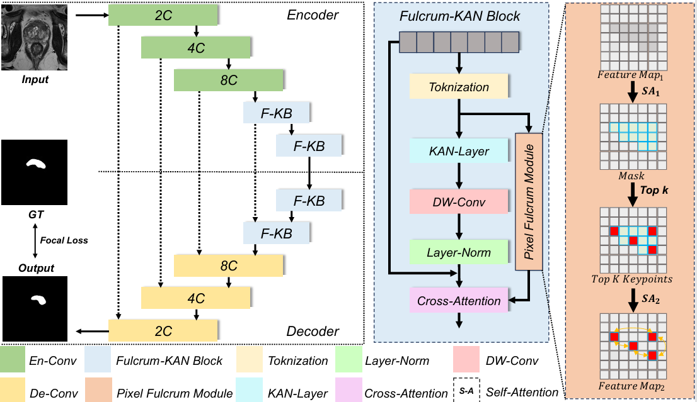

🧠 MyGO: Make Your Goals Obvious

MyGO is a deep learning model for prostate cancer MRI segmentation that avoids semantic confusion by selectively modeling key global features. It introduces a novel Pixel Fulcrum Module and integrates self-attention with Top-k selection to enhance feature interpretation while reducing computational redundancy. The architecture is built upon a U-KAN backbone and leverages KAN Layers for nonlinear semantic learning.

🎯 Highlights

Pixel Fulcrum Module: Learns sparse anchors to capture semantic context.

Top-k Attention: Selects the most relevant anchor features.

Focal Loss Integration: Addresses class imbalance in small lesion regions.

U-KAN Framework: Strong modeling for high-order nonlinear features.

SOTA Performance: Achieved 69.73% mIoU and 74.32% Dice on the PI-CAI dataset.

| Method       | mIoU (%) | Dice (%) | Specificity (%) | FPR (%) |
|--------------|----------|----------|-----------------|---------|
| U-Net        | 24.00    | 35.64    | 99.57           | 0.43    |
| RollingUnet  | 43.31    | 54.65    | 99.66           | 0.21    |
| U-KAN        | 66.82    | 72.94    | 99.66           | 0.21    |
| MyGO†        | 69.73    | 74.32    | 99.87           | 0.13    |
